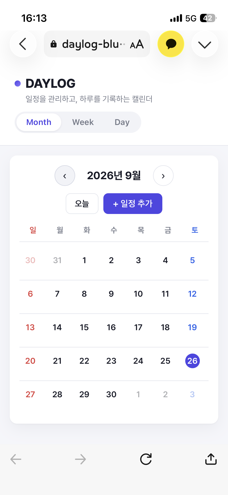
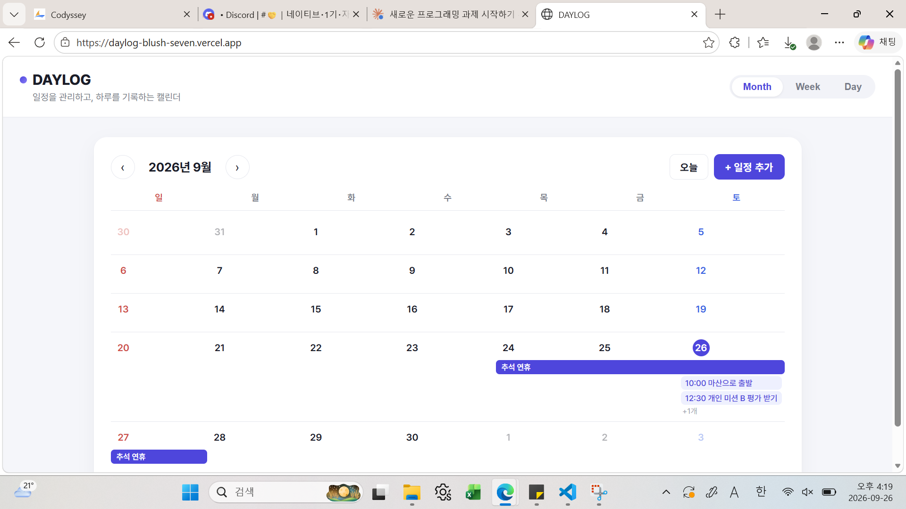
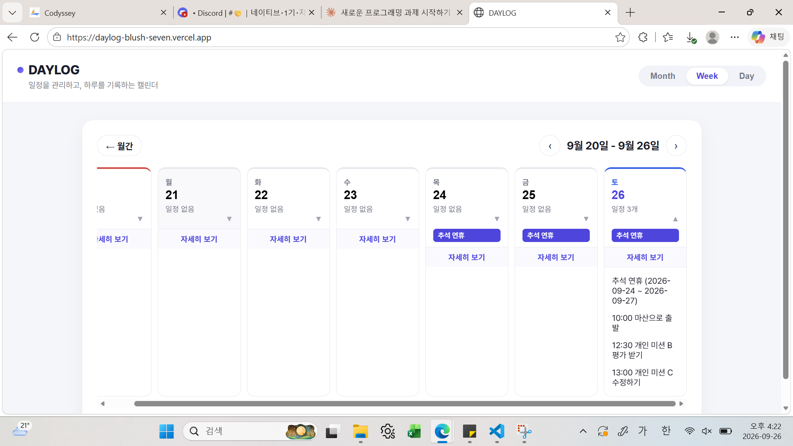
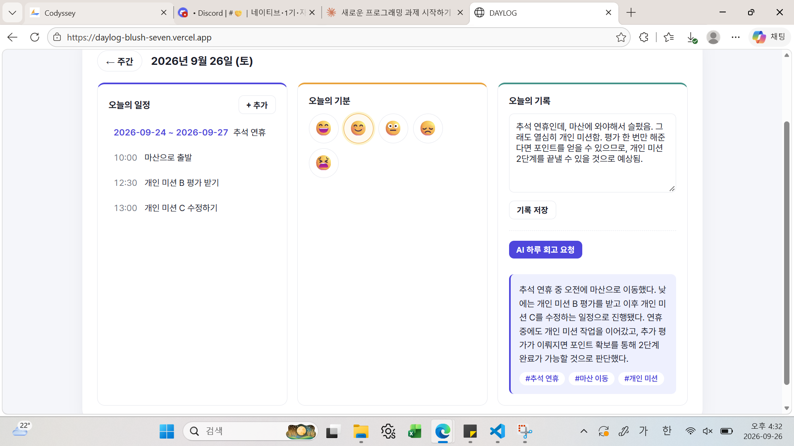

# DAYLOG

일정을 관리하고, 하루를 기록하며, AI와 함께 하루를 돌아보는 개인 캘린더 웹서비스입니다.

**배포 URL**: https://daylog-blush-seven.vercel.app

서비스 목적, 타겟 사용자, 화면 구성, AI 기능 상세 설계는 [PLANNING.md](PLANNING.md)를 참고해주세요.

## 기술 스택

- **프론트엔드**: HTML, CSS, Vanilla JavaScript (프레임워크 미사용)
- **백엔드**: Vercel Serverless Functions (Python)
- **AI 연동**: Codyssey 프록시 엔드포인트 (OpenAI 호환 Chat Completions API)
- **데이터 저장**: 브라우저 localStorage
- **배포**: Vercel (GitHub 연동 자동 배포)

## 프로젝트 구조

```
daylog/
├── index.html
├── css/
│   └── style.css
├── js/
│   ├── main.js
│   ├── calendar.js
│   ├── week.js
│   ├── day.js
│   ├── modal.js
│   └── storage.js
├── api/
│   └── reflect.py
├── screenshots/
├── requirements.txt
├── pyproject.toml
├── README.md
├── PLANNING.md
├── AI-USAGE-LOG.md
└── .env.example
```

프론트엔드(HTML/CSS/JS)와 백엔드(`api/`)가 폴더 단위로 명확히 구분되어 있습니다.

## 실행 방법

### 로컬에서 프론트엔드만 확인하기

```bash
git clone https://github.com/041211lhs/daylog.git
cd daylog
```

`index.html`을 VS Code Live Server 확장으로 열거나 브라우저로 직접 엽니다. (단, AI 회고 기능은 서버리스 함수가 필요해 정적 실행만으로는 동작하지 않습니다.)

### Vercel에 배포하기

1. GitHub에 저장소를 push
2. [vercel.com](https://vercel.com) → **Add New → Project** → 이 저장소 Import
3. Framework Preset: **Other**
4. 아래 [환경 변수](#환경-변수-설정) 등록
5. **Deploy**

## 환경 변수 설정

Vercel 프로젝트 → **Settings → Environment Variables**에 아래 3개를 등록합니다. (`.env.example` 참고)

| Key | 설명 | 예시 |
|---|---|---|
| `OPENAI_API_KEY` | AI API 인증 키 | 발급받은 키 값 |
| `OPENAI_BASE_URL` | AI API 엔드포인트 주소 | `https://copa.codyssey.kr/v1` |
| `OPENAI_MODEL` | 사용할 모델명 | `gpt-5.4` |

> API 키는 코드나 커밋 이력에 직접 작성하지 않고 환경 변수로만 관리합니다.

## 반응형 확인

데스크톱과 실제 스마트폰(모바일 브라우저) 두 가지 환경에서 직접 접속해 확인했습니다.

## 스크린샷

**모바일 (Month 화면)**



**데스크톱 - Month**



**데스크톱 - Week**



**데스크톱 - Day (AI 하루 회고 동작 포함)**



## 개발 과정에서 배운 점

- **HTML/CSS/JS 역할 분리**: HTML은 화면 구조, CSS는 레이아웃과 반응형 스타일, JavaScript는 날짜 계산·localStorage 저장·이벤트 처리·fetch 호출을 담당하도록 파일을 나눴습니다.
- **fetch 흐름**: 사용자가 기록을 입력하고 버튼을 누르면 JavaScript가 `fetch('/api/reflect', { method: 'POST', ... })`로 요청을 보내고, 응답이 오면 화면에 요약과 키워드를 렌더링합니다.
- **Vercel Serverless Functions(Python)**: `api/reflect.py`의 `handler` 클래스가 서버리스 함수가 되어 프론트의 POST 요청을 받아 AI API를 대신 호출합니다. `pyproject.toml`의 `[tool.vercel] entrypoint`로 실행할 함수를 지정해야 한다는 것을 배포 오류를 겪으며 알게 되었습니다.
- **환경 변수로 키 관리**: API 키를 프론트 코드에 두면 브라우저 개발자도구로 노출되기 때문에, 서버(Python 함수) 쪽에서만 `os.environ.get()`으로 읽도록 구성했습니다.
- **로컬 vs 배포 환경 차이**: 로컬에서 `index.html`만 열면 정적 화면은 보이지만 `/api/reflect`는 동작하지 않습니다. Vercel의 Framework Preset 설정이 배포 결과를 크게 바꾼다는 것도 직접 겪으며 확인했습니다.
- **디버깅 경험**: `pyproject.toml` entrypoint 형식 오류, `vercel.json`의 오래된 `runtime` 문법 오류, `uv lock`을 위한 `[project]` 테이블 누락, Framework Preset 불일치로 정적 파일이 안 뜨는 문제 등을 순서대로 겪었고, 각 에러 메시지를 기준으로 원인을 좁혀가며 해결했습니다.